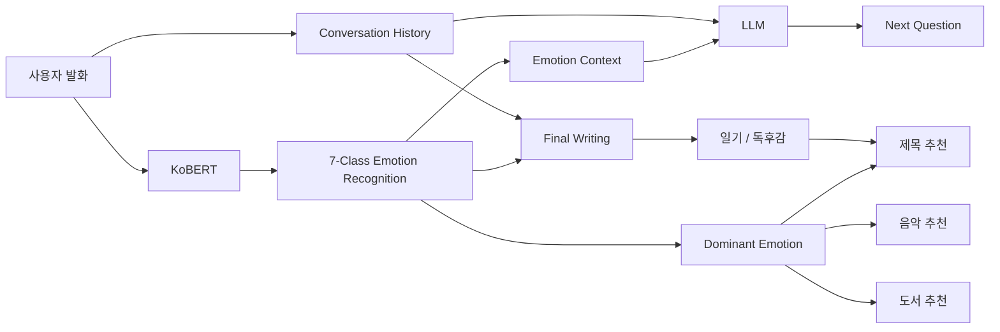
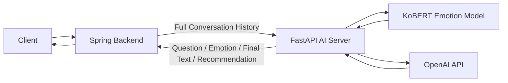
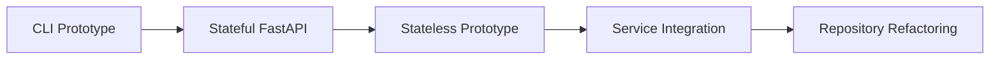

# 자투리 (Jatuli) - AI

> **AI와 대화하는 과정만으로 사용자의 경험과 감정을 정리해 일기와 독후감을 완성하는 감정 기반 AI Writing Service**

자투리는 글쓰기를 어려워하는 사용자가 빈 화면에서 직접 글을 시작하는 대신, AI와 자연스럽게 대화하면서 자신의 경험과 생각을 정리하고 최종적으로 일기 또는 독후감을 완성할 수 있도록 돕는 서비스입니다.

AI 서버는 사용자의 발화를 **KoBERT 기반 7-Class 감정분류 모델**로 분석하고, 대화 이력과 감정 정보를 LLM에 함께 전달하여 맥락에 맞는 후속 질문을 생성합니다. 대화가 종료되면 전체 대화와 감정 흐름을 기반으로 일기·독후감을 생성하고, 대표 감정에 따라 음악 또는 도서를 추천하며, 완성된 글에 어울리는 제목 후보까지 생성합니다.

- **프로젝트 개발:** 2025.08 ~ 2025.12
- **서비스 보완:** 2026.02 ~ 2026.03
- **저장소 리팩토링:** 2026.08
- **프로젝트 유형:** 졸업 프로젝트
- **담당:** AI Developer

> 아래의 AI 기능과 서비스 연동은 프로젝트 개발 과정에서 구현했으며, 공용 감정모델 구조·모델 Artifact 경로·Docker Runtime·환경변수 기반 LLM 설정·저장소 구조는 이후 포트폴리오 정리 과정에서 리팩토링했습니다.

---

## My Role

### 프로젝트 개발 당시

- AI Hub 감정 대화 데이터를 활용한 **KoBERT 7-Class 감정분류 모델 Fine-tuning**
- 감정분석 결과를 활용한 **Emotion-aware Multi-turn 질문 생성 로직 설계**
- 일기·독후감 생성을 위한 **LLM Prompt 설계 및 튜닝**
- 전체 사용자 발화의 감정분석 결과를 이용한 **대표 감정 추출**
- 대표 감정 기반 **음악·도서 추천 기능 구현**
- 추천 URL Hallucination 문제를 줄이기 위한 **Structured Output + Server-side URL 생성 방식 적용**
- 완성된 글과 대표 감정을 활용한 **제목 후보 생성 기능 구현**
- **FastAPI 기반 AI Server 구현 및 Spring Backend 연동**
- Stateful Prototype에서 **Stateless Architecture**로 서비스 구조 개선

### 이후 저장소 리팩토링

- 학습·단독 추론·서비스 추론이 동일한 KoBERT 구조를 사용하도록 모델 코드 공통화
- 모델 Weight와 Label Mapping의 저장 위치 및 환경변수 설정 표준화
- API 입력값 검증 강화 및 최근 감정 추론 시 불필요한 반복 추론 제거
- Docker 실행 Entry Point와 Runtime dependency 정리
- 개발 중간 버전을 `legacy/`로 분리하여 현재 실행 코드와 개발 이력을 구분

---

## Core Features

| 기능 | 설명 |
|---|---|
| Emotion Recognition | 사용자 발화를 7개 감정으로 분류 |
| Multi-turn Question | 이전 대화와 최근 감정을 고려하여 다음 질문 생성 |
| Diary Generation | 전체 대화를 기반으로 자연스러운 1인칭 일기 생성 |
| Book Review Generation | 대화를 기반으로 서론-본론-결론 구조의 독후감 생성 |
| Emotion-based Recommendation | 대표 감정에 따라 음악 또는 도서 추천 |
| Title Generation | 완성된 글에 어울리는 제목 후보 3개 생성 |
| Stateless AI API | Spring이 대화 상태를 관리하고 AI 서버는 전달받은 전체 이력 기반으로 처리 |

---

## AI Pipeline



자투리의 AI Pipeline은 KoBERT와 LLM을 독립적으로 사용하는 것이 아니라, **감정분류 모델의 결과를 LLM의 대화 및 생성 Context에 연결**하는 것을 핵심으로 합니다.

---

## 7-Class Emotion Recognition

### Dataset

감정분류 모델 학습에는 **AI Hub 감정 대화 데이터**를 활용했습니다.

- Dataset: 감정이 태깅된 자유대화 데이터
- 입력 Column: `발화문`
- Target Column: `1번 감정`
- Train / Validation Split: `90% / 10%`
- Stratified Split 적용
- Random State: `42`

AI Hub Dataset: https://aihub.or.kr/aihubdata/data/view.do?dataSetSn=263

원본 및 학습용으로 가공한 데이터 파일은 공개 저장소에 포함하지 않습니다. 데이터 준비 방법은 [`data/README.md`](./data/README.md)를 참고하세요.

### Emotion Classes

사용자의 발화를 다음 7개 감정으로 분류합니다.

| Emotion |
|---|
| 분노 |
| 혐오 |
| 두려움 |
| 기쁨 |
| 중립 |
| 슬픔 |
| 놀람 |

학습 단계에서는 `LabelEncoder`를 사용하며, 학습 시 생성된 `classes.npy`를 함께 저장하여 서비스 추론 시에도 학습 당시의 Label 순서를 그대로 사용합니다. 현재 서비스 실행 시 `classes.npy`는 필수 Artifact입니다.

### Model Architecture

사전학습된 **KoBERT**를 기반으로 Classification Head를 추가하여 Fine-tuning했습니다.

```text
Input Text
    ↓
KoBERT Tokenizer
    ↓
KoBERT
    ↓
Pooler Output
    ↓
Dropout (0.3)
    ↓
Linear Layer (768 → 7)
    ↓
Softmax
    ↓
Emotion
```

학습과 서비스에서 서로 다른 모델 구조가 사용되지 않도록 `src/emotion_model.py`의 `EmotionClassifier`를 공용으로 사용합니다.

### Training Configuration

| Configuration | Value |
|---|---|
| Max Sequence Length | 64 |
| Batch Size | 16 |
| Optimizer | AdamW |
| Learning Rate | 2e-5 |
| Loss Function | CrossEntropyLoss |
| Maximum Epoch | 10 |
| Validation Split | 10% |
| Early Stopping | Validation Loss 기준 |
| Early Stopping Patience | 2 |

Validation Loss가 개선될 때마다 Best Model을 저장합니다.

```text
models/
├── emotion_model.pt
└── classes.npy
```

`emotion_model.pt`는 Fine-tuned KoBERT의 Weight이며, `classes.npy`는 학습 당시의 Label 순서를 보존합니다.

---

## Emotion-aware Multi-turn Conversation

자투리에서는 기존 대화 내용뿐 아니라 KoBERT가 분석한 **최근 사용자 감정**을 후속 질문 생성 Context에 함께 전달합니다.

```text
Conversation History
        +
Latest Emotion
        ↓
LLM Prompt
        ↓
Context-aware Next Question
```

Prompt에는 다음 원칙을 적용합니다.

- 기존 질문을 반복하지 않기
- 최근 답변과 감정에 자연스럽게 이어지는 질문 생성
- 감정분류 결과만으로 사용자의 감정을 단정하거나 진단하지 않기
- 사용자가 자신의 경험을 더 이야기할 수 있는 질문 생성
- 한 번에 하나의 한국어 질문만 생성

다음 질문을 생성할 때는 전체 사용자 발화를 다시 추론하지 않고, **가장 최근 USER 발화만 KoBERT로 분석**합니다. 전체 감정 흐름이 필요한 최종 글 생성 단계에서는 모든 USER 발화를 분석합니다.

---

## Final Writing Generation

대화가 끝나면 사용자 발화 각각에 대해 감정을 분석하고, 전체 Conversation History와 함께 최종 글 생성 Context로 전달합니다.

```text
전체 Conversation History
        +
각 사용자 발화의 Emotion
        +
Dominant Emotion
        ↓
LLM
        ↓
일기 / 독후감
```

### Diary

사용자의 경험과 대화 내용을 유지하면서 자연스러운 **1인칭 일기** 형태로 생성합니다.

### Book Review

사용자가 대화 과정에서 이야기한 책에 대한 생각을 기반으로 **서론-본론-결론 구조의 1인칭 독후감**을 생성합니다.

감정분석 결과는 새로운 사실을 만들어내기 위한 근거가 아니라, 글의 정서적인 흐름을 조절하기 위한 **보조 Context**로 사용합니다.

---

## Dominant Emotion & Recommendation

각 사용자 발화에서 추출한 Emotion 중 가장 많이 등장한 감정을 대표 감정으로 결정합니다.

```text
[기쁨, 기쁨, 중립, 슬픔, 기쁨]
                ↓
Dominant Emotion = 기쁨
```

작성 모드에 따라 대표 감정을 활용한 추천 대상이 달라집니다.

```text
Diary → Music Recommendation
Book Review → Book Recommendation
```

음악 추천은 `title`, `artist`, `genre`, `reason`을, 도서 추천은 `title`, `author`, `genre`, `one_line`, `reason`을 Structured JSON으로 생성합니다.

---

## Recommendation Hallucination Handling

### Problem

초기 구현에서는 LLM에게 추천 대상뿐 아니라 YouTube 또는 서점 URL까지 직접 생성하도록 요청했습니다. 그러나 생성형 모델이 실제 페이지와 일치하지 않는 URL을 만들 가능성이 있어 사용자가 잘못된 링크를 받을 수 있다는 문제가 있었습니다.

### Solution

추천 정보 생성과 URL 생성을 분리했습니다.

```text
LLM
    ↓
Structured JSON
    ↓
title / artist / author / genre / reason
    ↓
FastAPI Server
    ↓
Search URL 생성
```

LLM은 URL을 직접 생성하지 않고 추천에 필요한 구조화된 정보만 반환합니다. 실제 검색 URL은 서버에서 `quote_plus()`를 이용해 YouTube·교보문고·알라딘 검색 URL로 생성합니다.

이를 통해 **LLM이 존재하지 않는 URL을 직접 생성하는 문제를 줄이고**, 링크 생성 책임을 Server Logic으로 분리했습니다.

---

## Title Generation

최종 일기 또는 독후감 생성 후 글의 내용과 대표 감정을 기반으로 서로 다른 표현의 제목 후보 3개를 생성합니다. 사용자는 AI가 제안한 제목 중 하나를 선택하거나 직접 제목을 입력할 수 있습니다.

---

## Service Architecture



### Spring Backend

- 사용자 Session 관리
- 전체 Conversation History 관리
- AI Server와 API 통신

### FastAPI AI Server

- 사용자 발화 감정분석
- 감정 기반 다음 질문 생성
- 일기·독후감 생성
- 대표 감정 계산
- 음악·도서 추천
- 제목 후보 생성

---

## Stateful → Stateless

초기 FastAPI Prototype에서는 AI 서버 내부에서 사용자별 Conversation Session을 직접 관리했습니다. 서비스 Backend와 연동하는 과정에서는 Spring Backend가 이미 사용자 Session과 대화 이력을 관리하기 때문에 AI Server가 동일한 상태를 별도로 관리할 필요가 없다고 판단했습니다.

최종 구조에서는 Spring이 요청마다 전체 대화 이력을 전달하고, AI Server는 전달받은 데이터만으로 처리하는 **Stateless 구조**를 사용합니다.

---

## API

| Method | Endpoint | Description |
|---|---|---|
| GET | `/health` | AI Server 상태 확인 |
| GET | `/api/ai/start` | 일기/독후감 첫 질문 반환 |
| POST | `/api/ai/next-question` | 대화 이력과 최근 감정을 기반으로 다음 질문 생성 |
| POST | `/api/ai/finalize` | 최종 글, 대표 감정, 추천 결과 생성 |
| POST | `/api/ai/title` | 제목 후보 생성 또는 제목 확정 |

현재 API 입력은 서비스에서 사용하는 값에 맞춰 제한합니다.

```text
mode: diary | book
role: AI | USER
```

잘못된 값은 FastAPI/Pydantic Validation 단계에서 거부됩니다.

---

## LLM Configuration

프로젝트 개발 당시에는 **GPT-4o-mini**를 질문 생성·추천 등의 빠른 작업에, **GPT-4o**를 최종 글 생성에 사용했습니다.

이후 저장소 리팩토링 과정에서 특정 모델명이 서비스 코드에 고정되지 않도록 환경변수 기반 구조로 개선했습니다.

```env
OPENAI_MODEL_FAST=...
OPENAI_MODEL_DEEP=...
```

현재 리팩토링 코드의 기본 설정은 다음과 같습니다.

```text
OPENAI_MODEL_FAST = gpt-5.6-luna
OPENAI_MODEL_DEEP = gpt-5.6-terra
```

따라서 모델 교체 시 AI Server의 비즈니스 로직을 수정하지 않고 환경변수만 변경할 수 있습니다.

---

## Project Structure

```text
ai/
├── Dockerfile
├── requirements.txt
├── README.md
├── data/
│   └── README.md
├── models/
│   └── README.md
├── src/
│   ├── ai_server.py
│   ├── emotion_model.py
│   ├── emotion_predict.py
│   └── emotion_train.py
└── legacy/
    ├── README.md
    ├── 01_cli_prototype.py
    ├── 02_stateful_fastapi_server.py
    └── 03_stateless_server_prototype.py
```

- `src/ai_server.py`: 현재 서비스 기준 Stateless FastAPI AI Server
- `src/emotion_model.py`: 학습·CLI Prediction·AI Server가 공통으로 사용하는 KoBERT Classifier/Predictor
- `src/emotion_train.py`: AI Hub 감정 대화 데이터를 이용한 KoBERT Fine-tuning 코드
- `src/emotion_predict.py`: Fine-tuned 모델 단독 테스트용 CLI Prediction 코드
- [`data/README.md`](./data/README.md): 외부 학습 데이터 준비 방법
- [`legacy/`](./legacy): 개발 과정에서 사용했던 이전 구현 보존

---

## Model Artifacts

Fine-tuned 모델 Weight와 학습 당시 Label Mapping은 Git Repository에 포함하지 않습니다.

실행 전 다음 두 파일이 모두 필요합니다.

```text
models/
├── emotion_model.pt
└── classes.npy
```

- `emotion_model.pt`: KoBERT 7-Class Emotion Classifier의 Fine-tuned Weight
- `classes.npy`: 학습 당시 `LabelEncoder.classes_`를 저장한 Label Mapping

`classes.npy`가 없으면 모델 출력 Index와 실제 Emotion Label의 대응을 보장할 수 없기 때문에 서비스가 실행되지 않도록 구성했습니다.

자세한 내용은 [`models/README.md`](./models/README.md)를 참고하세요.

---

## Installation

### 1. Repository Clone

```bash
git clone https://github.com/jatuli-25-2/ai.git
cd ai
```

### 2. Python Environment

Python 3.10 환경을 권장합니다.

```bash
python -m venv .venv
```

Windows:

```bash
.venv\Scripts\activate
```

macOS / Linux:

```bash
source .venv/bin/activate
```

Dependency 설치:

```bash
pip install -r requirements.txt
```

### 3. Training Data

모델을 직접 Fine-tuning하려면 AI Hub의 해당 데이터셋 이용 조건을 확인한 뒤 학습용 CSV를 별도로 준비합니다.

```text
data/emotion_data.csv
```

CSV에는 현재 학습 코드가 사용하는 `발화문`, `1번 감정` 컬럼이 필요합니다. 자세한 내용은 [`data/README.md`](./data/README.md)를 참고하세요.

### 4. Model Files

서비스를 실행하려면 다음 두 파일을 `models/` 디렉터리에 배치합니다.

```text
models/emotion_model.pt
models/classes.npy
```

데이터를 준비한 뒤 직접 학습하려면 프로젝트 루트에서 다음 명령을 실행합니다.

```bash
python src/emotion_train.py
```

Validation Loss가 개선될 때 Best Model과 Class Mapping이 `models/`에 자동 저장됩니다.

### 5. Environment Variables

```env
OPENAI_API_KEY=your_api_key
OPENAI_MODEL_FAST=gpt-5.6-luna
OPENAI_MODEL_DEEP=gpt-5.6-terra
EMOTION_MODEL_PATH=models/emotion_model.pt
EMOTION_CLASSES_PATH=models/classes.npy
```

`OPENAI_MODEL_FAST`, `OPENAI_MODEL_DEEP`, `EMOTION_MODEL_PATH`, `EMOTION_CLASSES_PATH`는 환경에 따라 변경할 수 있습니다. API Key는 Repository에 저장하지 않습니다.

---

## Run

### Local

```bash
uvicorn --app-dir src ai_server:app --host 0.0.0.0 --port 8000
```

Health Check:

```text
GET /health
```

### Docker

Build:

```bash
docker build -t jatuli-ai .
```

Run:

```bash
docker run \
  --rm \
  -p 8000:8000 \
  --env-file .env \
  -v "$(pwd)/models:/app/models" \
  jatuli-ai
```

모델 Weight와 Label Mapping은 Docker Image 내부에 포함하지 않습니다. Docker Runtime에서는 기본적으로 CPU 기반 PyTorch 환경을 사용하여 학습 환경과 Serving 환경을 분리했습니다.

---

## Development History

자투리 AI 기능은 한 번에 현재 구조로 만들어진 것이 아니라, Prototype을 서비스에 연동하는 과정에서 단계적으로 발전했습니다. 이후 저장소 리팩토링에서는 당시 기능을 유지하면서 실행 구조와 문서의 정합성을 정리했습니다.



### 1. CLI Prototype

- KoBERT Emotion Recognition
- 감정 기반 후속 질문 생성
- 기본 Multi-turn Q&A
- 일기 생성
- 대표 감정 기반 음악 추천

### 2. Stateful FastAPI

CLI 기능을 API 형태로 확장하고 FastAPI Server 내부에서 사용자별 Session과 Q&A 상태를 관리했습니다.

### 3. Stateless Prototype

Spring Backend와 연동하면서 Conversation State의 책임을 Backend로 이동했습니다. Spring이 전체 대화 이력을 AI Server에 전달하고, AI Server는 전달받은 데이터만을 기반으로 처리하도록 구조를 변경했습니다.

### 4. Service Integration & Improvement

- Diary / Book Review Generation
- Emotion-based Recommendation
- Structured LLM Output
- Server-side Search URL Generation
- Title Generation
- Docker 기반 배포 구성

### 5. Repository Refactoring

- 공용 KoBERT Emotion Model
- 모델 Artifact 경로 표준화
- API 입력 Validation
- 최근 발화 중심 감정 추론 최적화
- 환경변수 기반 LLM 설정
- 현재 실행 코드와 Legacy 코드 분리
- 데이터 및 모델 Artifact의 공개 저장소 관리 정리

과거 구현은 [`legacy/`](./legacy)에서 확인할 수 있습니다.

---

## Tech Stack

| Category | Technology |
|---|---|
| Language | Python |
| Deep Learning | PyTorch |
| NLP Model | KoBERT |
| NLP Library | Transformers, kobert-transformers |
| LLM | OpenAI API |
| AI API Server | FastAPI |
| Validation / Schema | Pydantic |
| Data Processing | Pandas, NumPy |
| Machine Learning Utility | scikit-learn |
| Backend Integration | Spring |
| Deployment | Docker |

---

## Limitations & Future Work

현재 대표 감정은 각 사용자 발화의 감정분류 결과 중 가장 빈번하게 등장한 Emotion Class를 기준으로 결정합니다. 또한 현재 질문 생성에서는 전체 Conversation History와 최근 감정을 활용하지만, 장기간의 대화에서 중요한 정보를 별도로 추출·저장·검색하는 Long-term Memory 구조까지 구현되어 있지는 않습니다.

향후 개선 방향:

- Emotion Probability를 활용한 감정 변화 추적
- 최근 발화에 더 높은 Weight를 적용한 대표 감정 계산
- Conversation Summary 및 중요 정보 추출
- Long-term Conversation Memory 구성
- Memory Retrieval 및 Ranking
- Emotion Context와 Memory를 함께 활용한 질문 생성
- 질문 품질 및 글 생성 품질에 대한 Evaluation Pipeline 구축
- 감정분류 모델에 대한 Accuracy / Precision / Recall / F1 기반 실험 관리
